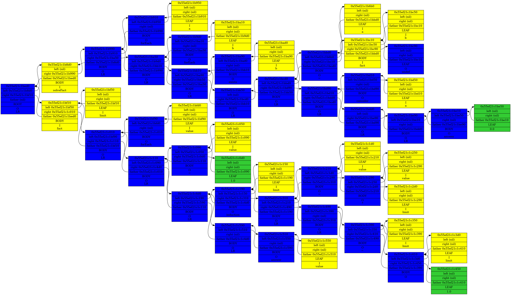
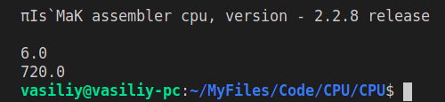

# __Свой язык программирования (ЯП)__
#### Это последний проект в рамках 1 семестра обучения в группе Дединского И.Р.

# Задачи
- __Грамматически составить свой язык программирования (ЯП)__, поддерживающий базовый функционал: переменные и выражения с ними; условные переходы; циклы; функции и их вызов.
- __Имплементировать компилятор для своего ЯП__: Компилятор должен транслировать код, написанный в соответствии с грамматикой ЯП, в ассемблерный код моего формата.

# Грамматика

В связи с тем, что сессия была близко, я решил создать тематическую грамматику: код, написанный на моем ЯП метафорически является черновиком студента на письмаке по Матанализу. Язык будет составлен из ряда лексем, состоящих из символов Английского алфавита, цифр и некоторых других символов.

---

### __Обозначения для грамматики:__

>Декларация новой лексемы обозначается так:
>```
>ЛЕКСЕМА ::= /* из чего состоит лексема */
>```
>Например, так будет выглядеть декларация новой лексемы words:
>```
>words ::= { word ' ' } '.'
>```
>Если выражение записано в фигурных скобках, это значит, что оно может быть продублированно в этом месте любое количество раз. А то, что символы записаны в кавычках, значит, что они напрямую подставляются.
>
>Осталось определеить лексему word:
>```
>word ::= [a-z A-Z]
>```
>Запись символов в квадратных скобках значит, что в этом месте может содержаться любая последовательность из данных символов.
>
>Тогда, согласно нашей грамматике, текст:
>```
>    digital farm loop Rom QWERTY boss ssjhdbvk JKJKasf .
>```
>Является words.

---

### __Получилась следующая грамматика для моего ЯП (комментарии помечены так: /* комментарий */):__

```
Code ::= { Func }

Func ::= Ident '(' { Ident ' ' }* ')' Body /* если после лексемы стоит символ '*', это значит, что данный символ может быть исключен из выражения */

Body ::=
         '{'
              { LR }*
         '}'

Ident ::= [a-z A-Z] [a-z A-Z _ 0-9]*

LR ::= Expr | Constr /* С помощью символа '|' обозначается, что LR это или Expr, или Constr */
Constr ::= if | while | return | decl | break

if ::= 'root' '(' Expr ')' Body

while ::= 'induction' '(' Expr ')' Body

return ::= 'answer ' Expr

decl ::= 'forEach ' Ident

break ::= 'fuckThis' TR-symbol

TR-symbol ::= '=>' | '|-->' | '#.'

Expr ::= 1st-PriorityExpr TR-symbol

1st-PriorityExpr ::=
2nd-PriorityExpr { [+-] 2nd-PriorityExpr }*

2nd-PriorityExpr ::=
3rd-PriorityExpr { [*/] 3rd-PriorityExpr }*

3nd-PriorityExpr ::=
4th-PriorityExpr { [^] 4th-PriorityExpr }*

4th-PriorityExpr ::= Call | Ident | Braces | Number

Number = '-'* [0-9] '.'* [0-9]
Call ::= Ident ( { Ident ' ' }* )
Braces ::= '(' Expr ')'
```

---

### __Итак, грамматика готова. Я написал пример кода, в котором производится вычисление факториала:__

```
solveFact ( )
{
    forEach a
    forEach b

    exists b |-->

    a = fact (b) =>
    consider a =>

    answer 0 #.
}

fact ( limit )
{
    forEach value

    value = 1 =>

    induction (limit)
    {
        value = value * limit =>

        limit = limit - 1 =>
    }

    answer value #. 
}
```

---

### __Теперь можно приступать к имплементации компилятора.__

# Компилятор

## __Я осуществил трансляцию в Ассемблерный код в несколько этапов:__
- ### _Токенизация_
- ### _Рекурсивный спуск_
- ### _Трансляция дерева лексического анализа_

---

## __Токенизация__

Я считываю код из файла в буфер и разбиваю этот текст на простейшие лексемы (токены). Я выделил 4 основных типа токенов:
- Числа
- Идентификаторы (имена для функций и переменных)
- Ключевые слова (встроенные в язык)
- Терминальные символы

Так выглядят форматные строки для распознавания токенов (я использую функцию стандартной библиотеки sscanf): 

```c++
/* max format str size */
static const size_t INPUT_FORMAT_MAX_LEN_ = 64;

/* choose correct sequences of symbols
 * first  format string in pair is for first symbol (usually first symbol have diffirent rules)
 * second format string in pair is for all next symbols
 */
const char INPUT_FORMATS_[][2][INPUT_FORMAT_MAX_LEN_] = {
      /* for non-inbuild identifiers
       * SHOULD CHECK AT FIRST, BECAUSE THEN,
       * IF THERE ARE NO MATCHES IN CASES, ERROR CAN BE EASELY FOUND
       */
      { "%1[A-Za-z_]"      , "%15[A-Za-z0-9_]%n"   } ,
      /* for terminal    sequences    */
      { "%1[=>{}()|#]"     , "%15[=>{}().-]%n"     } ,
      /* for inbuild     keywords     */
      { "%1[A-Za-z_]"      , "%15[A-Za-z0-9_]%n"   } ,
      { "%1[+/=|&><*^-]"   , "%15[|&=]%n"          }   /* one symbol key words should be checked after all */
};
```

---

## Рекурсивный спуск

### Я реализовал ряд функций, которые рекурсивно вызывают друг-друга и осуществляют трансляцию массива токенов в бинарное дерево с токенами в узлах, вот пример такого дерева:<br/>


### Данная трансляция нужна, чтобы:
- Проверить соблюдение грамматики.
- В дальнейшем работать с данным деревом (это удобнее, чем работать с текстом или с токенами).

---

## Трансляция в ассемблерный код

### Использовав все ту же концепцию рекурсивного спуска, я реализовал функции, предназначенные для трансляции дерева в ассемблерный код.

### Вот результат работы этих функций:

```
solveFact    PROC

            IN    R01
            PUSHA 
            MOV   R00 R01
            CALL  fact
            POPA  
            PUSH  R0F
            POP   R00
            PUSH  R00
            POP   

            OUT   R00
            PUSH  0.0
            EXIT  

ENDP

fact    PROC

            PUSH  1.0
            POP   R01
            PUSH  R01
            POP   

w0000 :
            PUSH  R00
            PUSH  0
            CMPS  
            JE    e0000
            PUSH  R01
            PUSH  R00
            MULS
            POP   R01
            PUSH  R01
            POP   

            PUSH  R00
            PUSH  1.0
            SUBS
            POP   R00
            PUSH  R00
            POP   
            JMP   w0000
e0000 :

            PUSH  R01
            POP   R0F
            RET   

ENDP
```

# Результаты

### Вот результаты запуска исполняемого файла, транслированного из полученного ассемблерного кода, на моем эмуляторе CPU:<br/>


---

## Задача успешно выполнена.
PS: Свое дерево я ~~посадил~~ реализовал, компилятор свой ~~построил~~ реализовал, осталось только ~~вырастить~~ отменторить ~~сына~~ первокура.
